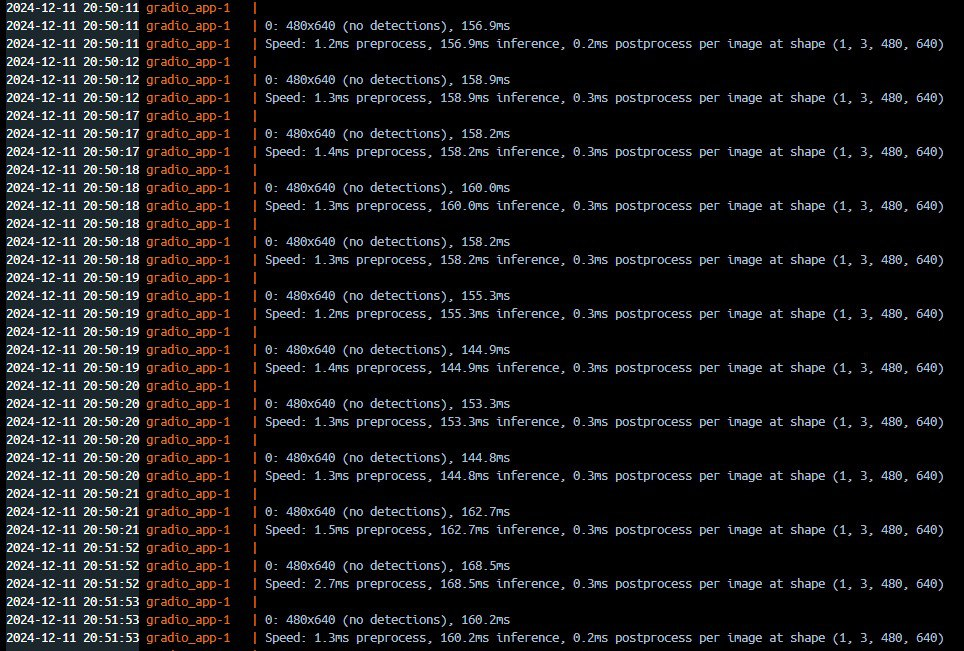

# В качестве курсовой работы был взят кейс СЗФО Окружной хакатон ИИ 11-13 октября (наша команда заняла 8 место)
Определение деффектов на ноутбуке  
Сам кейс:
```
Участникам предлагается разработать модель на основе исскусственного интелекта, способную находить дефекты на изображениях ноутбуков и классифицировать их. Решение требуется реализовать в виде веб-сервиса, который позволит наглядно определить дефекты на загруженных изображениях
```

---
# Описание работы программы: 
Пользователь загружает набор изображений с деффектами в веб сервис

#Программа выдает деффекты (пока что только в консоли/интерфейсе docker)

подробное описание см. в файле "документация к генератору синтетики.md"

---
sdk: gradio
---
Запуск локально:

python app.py

Запуск в докере

docker build
docker up -d